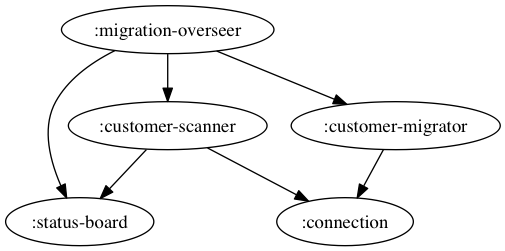

# DB Migrate Example

Ever wonder how to properly use a bunch of Clojure technology together:

* [core.async](https://github.com/clojure/core.async)
* [component](https://github.com/stuartsierra/component)
* [io.aviso/config](https://github.com/AvisoNovate/config)
* [walmartlabs/active-status](https://github.com/walmartlabs/active-status)
* [walmartlabs/system-viz](https://github.com/walmartlabs/system-viz)
* and [tools.cli](https://github.com/clojure/tools.cli) for good measure?

Well, look no further. 

This project is a snapshot of code extracted from real live code in use
at Walmartlabs.
The original code performs an update across a huge number of rows stored
in a Cassandra database.

This version has had all the actual database work replaced with sleeps,
so it's a bit of a toy. 
But what we've kept is:

* Parsing of command line options
* Creation of a component system
* Visualization of the system components
* Execution of the "migration", using asynchronous processing jobs
* Dynamic console output of the status of all asynchronous jobs

Here's what is looks like in action:

## How it works

At startup, the program collects command line arguments.

These arguments are used when constructing the component system.

The component system initialized; part of that is reading
configuration.
Most of the configuration comes from the files under `resources/conf`.
However, any of the configuration can be overridden from the
comamnd line.

For example, to have only 5 processes, instead of 20:

    java -jar target/db-migrate-standalone.jar customer-migration/processes=5
    
Once the system is constructed, but not started, it is possible to
request a visualization of the component system map:

   java -jar target/db-migration-standalone.jar --visualize
   
The system map is not complicated:
   

   
But in real applications at Walmartlabs, we might have dozens of components
in a system, so having the option to get a visualization can be quite useful.

But normally, the startup code then asks the :migration-overseer component 
to start the migration; this kicks off a number of asynchronous processes to do the work.

Effectively, the :customer-scanner component performs a query against the database
to get a list of customers ids, which is fed into a core.async channel.
In this example code, it just makes up customer ids and has some random sleeps.

The overseer, meanwhile, has created migration jobs.
The migration jobs take customer-ids from the scanner's channel.
They act as a wrapper around the :customer-migrator component, which migrates a single customer.

As each customer is migrated (or, alternately, checked to see if it has been previosly migrated),
the migrator job writes a status value to a channel that is used by the overseer to track how many
customers have been migrated.

This continues until first all the customer ids have been read from the database, and then until
all the customer jobs have completed.

As different asynchronous jobs complete, their line in the status board is moved to the top of the list;
this isn't too aparent until the very end, when everything is shutting down.

The use of channels and buffers provides backflow: if the customer migrating jobs are keeping up with the flow
of customer ids from the scanner, the scanner will end up parking for a bit to let the jobs keep up.
This may seem like a minor detail, but without backflow of some sort, we could end up filling memory with customer ids to
migrate. 
Instead, we have a system where the database query will keep just a bit ahead of the customer migrating jobs.

The use of the config library means that the several factors can be "tweaked" to find the best performing solution: the number of processing jobs, the number of customer ids fetched at a time, and the size of the buffer on the 
customer ids channel.

## The Status Board

The status board is the code that writes to the console; the "active" part of active-status is that a line
on the board is reserved for each job, and the line updates in place.

There's a lot going on there, as new jobs can be created as needed, and existing jobs may complete.
Further, when a job is updated, its text is written as bold (bright) text; after a fraction of a second with no
further updates, it is rewritten using normal (dim) text.

   
